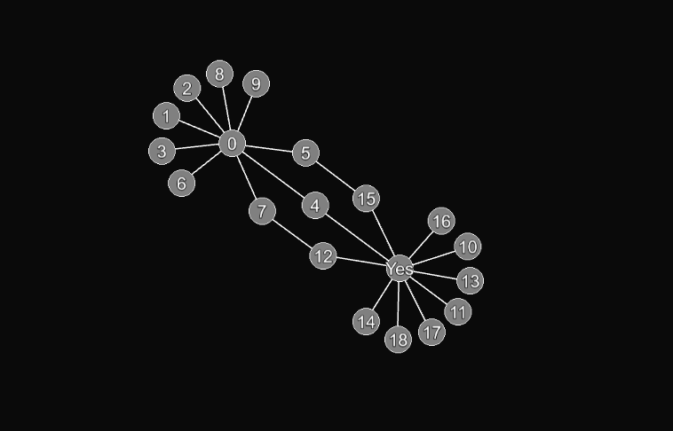

# UNLE.js
 An unconstrained node layout engine for those who really care about performance.

UNLE stands for Unconstrained Node Layout Engine.

Click [here](https://lochyj.github.io/UNLE/) for a demo.

## Recent developments

Here is an image of a node graph running in UNLE.js:

