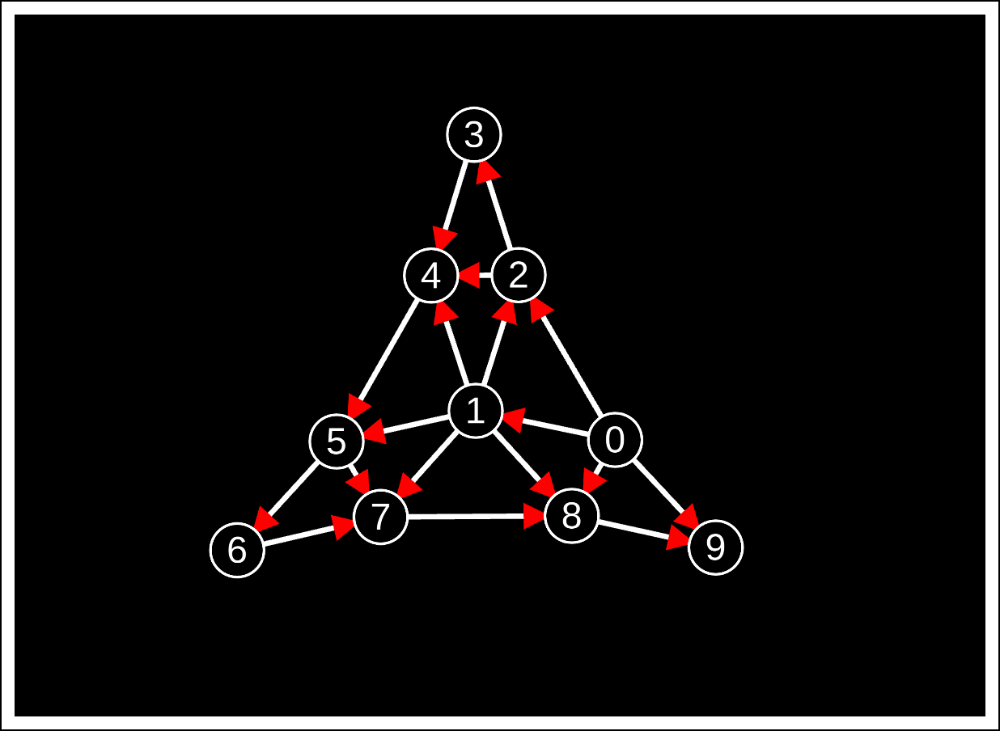

# UNLE.js
 UNLE is a medium performance node graph visualisation library designed for people who want quality and attention to detail

UNLE is an acronym for Unconstrained Node Layout Engine.



Click [here](https://rotaryviper.github.io/UNLE/) for a demo.

## Documentation

### Usage

Importing UNLE into your project:

```html
<script src="/path/to/UNLE.js"><script>
```

Creating a new UNLE instance:

```js
// Options are:
// "canvas" << required,
// "show_id" -> either true or false,
// "node_radius" -> any positive integer,
// "node_color" -> any HEX colour expressed such as 0x000000 for example,
// "edge_length" -> any positive integer
let graph = new UNLE({
    "canvas": document.getElementById("<div where you want UNLE to place the canvas>"),
    "node_color": 0xA0A0A0,
});
```

Adding nodes to the graph:

```js
// ID can be anything from an integer to a string
graph.add_node(<id>);
```

Adding edges to the graph:

```js
// INFO: length has been depreciated and will be removed in an upcoming version
graph.add_edge(<id of first node>, <id of second node>, <length of edge>);
```

Removing nodes from the graph:

```js
// This will also remove any connected edges
graph.remove_node(<id>);
```

Removing edges from the graph:

```js
graph.remove_edge(<id of first node>, <id of second node>);
```
